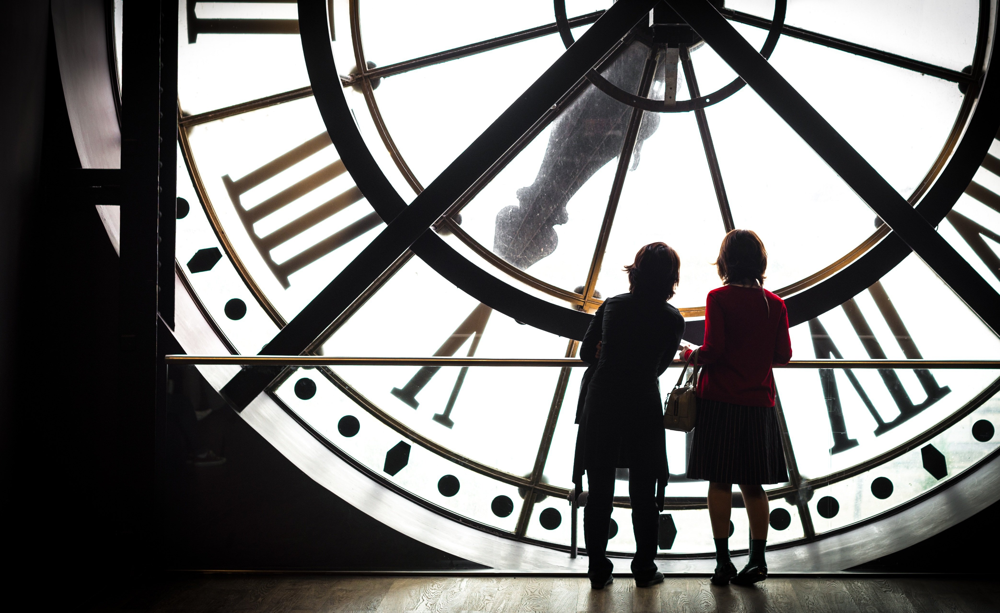

# 🕐 Digital Clock

A responsive digital clock web app with a live time display, AM/PM indicator, and date — styled with a frosted glass UI over a full-screen background image.



---

## ✨ Features

- **Live time display** — updates every second using `setInterval`
- **AM/PM indicator** — automatically switches based on the current hour
- **Date display** — shows today's date in localized format
- **Frosted glass UI** — modern `backdrop-filter: blur()` card over a full-screen background
- **Fully responsive** — adapts gracefully across all screen sizes (360px → 1280px+)

---

## 🗂️ Project Structure

```
digital-clock/
├── index.html       # Markup
├── style.css        # Styles + responsive breakpoints
├── script.js        # Clock logic
└── img.jpg          # Background image
```

---

## 🚀 Getting Started

No build tools or dependencies needed. Just clone and open.

```bash
git clone https://github.com/your-username/digital-clock.git
cd digital-clock
```

Then open `index.html` in your browser — that's it.

---

## 📐 Responsive Breakpoints

| Breakpoint | Target |
|---|---|
| `≥ 1280px` | Large desktops (default) |
| `≤ 1024px` | Small desktops / laptops |
| `≤ 768px` | Tablets |
| `≤ 480px` | Large phones |
| `≤ 360px` | Small phones |

---

## 🛠️ How It Works

The clock is driven by a plain JavaScript `Date` object refreshed every **1000ms**:

```js
setInterval(() => {
  showTime();
}, 1000);
```

Hours are normalized to 12-hour format and the AM/PM label is updated accordingly. Leading zeros are padded manually for consistent display.

---

## 🎨 Tech Stack

- **HTML5**
- **CSS3** — `backdrop-filter`, Flexbox, media queries
- **Vanilla JavaScript** — no libraries or frameworks

---

## 📄 License

[MIT](LICENSE)
